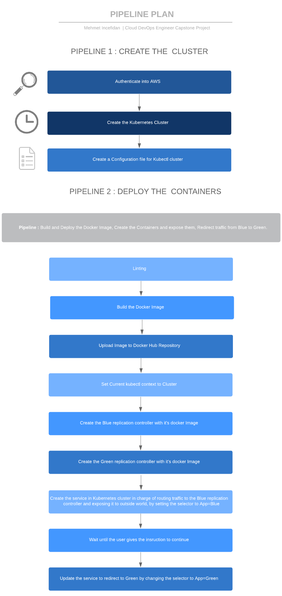

# Project 5 - Cloud DevOps Engineer Capstone Project

> In this project, I applied my skills and knowledge which was developed throughout the Cloud DevOps Nanodegree program.

## Project Tasks:

* Working in AWS
* Using Jenkins to implement Continuous Integration and Continuous Deployment
* Building pipelines
* Working with CloudFormation to deploy clusters
* Building Kubernetes clusters
* Building Docker containers in pipelines

## About Project: 

> I created a CI/CD pipeline for a basic website that deploys to a cluster in AWS EKS which is Blue/Green Deployment.



## Project Requirement:

> To be able to use this CI/CD pipeline you will need to install:

* Jenkins
* Blue Ocean Plugin in Jenkins
* Pipeline-AWS Plugin in Jenkins
* Docker
* Pip
* AWS Cli
* Eksctl
* Kubectl

## The files included are:
```sh
* /Images-of-result-deploy : Screenshot the result of deploy.
* /Create-clusters-pipeline : CloudFormation Script of Cluster Pipeline file 
* /Deploy-containers-pipeline : Deployment Script of Containers Pipeline file
* Jenkinsfile : Jenkinsfile for Creating Pipeline
* Dockerfile : Dockerfile for building the image 
* green-controller.json : Create a replication controller green pod
* green-service.json : Create the green service
* blue-controller.json : Create a replication controller blue pod
* blue-service.json : Create the blue service
* index.html : Web site Index file.
```

## Run the project:
```sh
* Please follow to steps of screenshot in Images-of-result-deploy folder.
```
